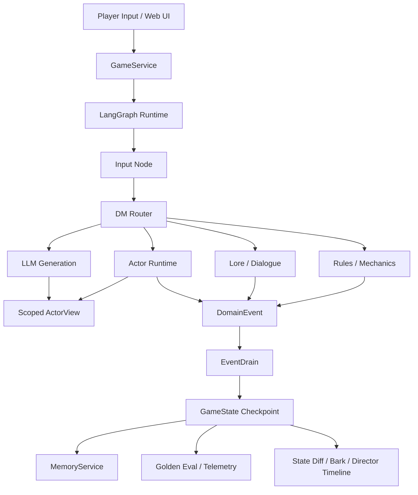

# BG3 LLM Agent — LLM-driven RPG Agent Runtime

**LLM-driven NPC behavior and dialogue agents for RPG games.**

[](https://www.python.org/)
[](https://github.com/langchain-ai/langgraph)
[](https://fastapi.tiangolo.com/)
[](#golden-eval)
[](BENCHMARK.md)
[](unity_client/)

<br>

> **Author:** [Your Name] — CS MSc @ Queen Mary University of London
> **Focus:** AI Agent Systems · Game AI · LLM Application Engineering
> **Open to:** 2026/2027 Game AI / LLM Agent engineering roles
>
> 📧 zx296752395@gmail.com &nbsp;|&nbsp; 🐙 [github.com/yukinorin775780](https://github.com/yukinorin775780)

---

## 🎬 [▶ Watch the 3-Minute Demo](https://github.com/yukinorin775780/BG3-LLM-Agent/releases/tag/demo-v2-20260622)

> 183 seconds · 1920×1080 H.264 · English subtitles · Full Act 1 → Act 4 playthrough
>
> Acceptance: `demo_cleared=true` · `act4_final_exit_opened=true` · `player_inventory.heavy_iron_key=1`
>
> 📋 [Release notes & recording methodology →](docs/demo_release_2026-06-22.md)

---

## TL;DR

- **What:** A playable dungeon encounter where AI companions perceive hidden traps,
  remember your choices, argue about strategy, and change game outcomes.
- **How:** [LangGraph](https://github.com/langchain-ai/langgraph) state machine routes player input through
  deterministic game systems; LLMs handle only expression and intent interpretation.
- **Why it matters:** LLM output never directly mutates world state — all consequences
  pass through `DomainEvent` → `EventDrain` → deterministic `physics.py` pipelines.
- **Stack:** Python · LangGraph · FastAPI · ChromaDB · Phaser 3 (Web) · Unity C# (3D)
- **Evidence:** 50+ pytest cases · Golden Eval regression suite · Jest frontend tests ·
  real LLM benchmark reports · fresh-session browser acceptance recording

---

## Portfolio Pitch

BG3 LLM Agent explores one core question:

> How do you make AI-driven RPG characters feel player-perceivable, stateful,
> and game-safe inside a playable loop?

The answer here is not a bigger prompt. The project separates:

- **LLMs** for intent interpretation, character expression, and open-ended dialogue.
- **Deterministic systems** for dice checks, physics, state mutation, memory isolation,
  item transfer, affection deltas, and regression safety.
- **Frontend feedback** for companion barks, dice cards, map highlights, state diffs,
  and a readable Director Timeline.

The result is a compact but complete AI CRPG encounter: the player escapes a
necromancer lab while companions notice hidden traps, react to discoveries, remember
social choices, argue about a boss, and unlock different outcomes based on what the
player learned earlier.

The important design constraint is that LLM output does not directly mutate the
world. Player intent, dice checks, NPC proposals, memory writes, inventory transfer,
status effects, and final objective completion all pass through explicit runtime
systems. The demo is intentionally small so that every AI-visible moment is also
player-visible and testable.

---

## What This Demonstrates

- **NPC personality and agenda modeling**: Astarion, Shadowheart, and Lae'zel propose
  different plans instead of acting as interchangeable chatbots.
- **Scoped actor perception**: NPCs receive filtered `ActorView` data rather than
  unrestricted global state.
- **D&D-style checks**: perception, disarm, lockpicking, lore reading, persuasion,
  and combat-adjacent outcomes use ability scores, DCs, dice, and replayable results.
- **Memory and relationship continuity**: private memory, party-shared knowledge,
  affection changes, and remembered rebukes alter later dialogue.
- **State-driven branching**: reading the diary changes the Gribbo negotiation;
  skipping that knowledge removes the truth-based advantage.
- **Game-safe LLM integration**: LLMs can suggest intent and expression, but state
  changes are committed through `DomainEvent` and `EventDrain`.
- **Regression and performance discipline**: deterministic golden evals protect
  narrative behavior, while real benchmark runs measure LLM latency and prompt budget.

---

## Playable Vertical Slice: Necromancer Lab V2

```text
Act 1      Safe Room
Act 2      Poison Corridor
Act 3      Secret Study
Act 4      Gribbo Lab
Final      Exit Door
```

The demo path is intentionally small, but it exercises the full agent stack:

1. **Act 1: Wake Up**
   The party wakes in a sealed lab room and opens the door into the next space.

2. **Act 2: Poison Corridor**
   Astarion can notice a hidden gas trap. The player can order him to disarm it.
   The UI shows companion bark, trap marker, dice/state feedback, and map effects.

3. **Act 3: Secret Study**
   The direct route can fail forward. A failed lockpick reveals a cracked wall
   beside the locked lab door. The party enters a connected secret study, reads
   chemical notes, decodes the necromancer diary, and gains information about Gribbo.

4. **Act 4: Gribbo Boss Encounter**
   The final obstacle is not a chatbot. Gribbo holds the key, guards the exit,
   and controls an unstable poison system. The party proposes competing plans,
   and diary truth acts as an encounter advantage rather than a free skip.

5. **Final Exit**
   The heavy iron key opens the final door and clears the demo.

---

## Example Player-Visible Agent Moments

For a fuller set of dialogue/state examples, see
[Dialogue Examples](docs/dialogue_examples.md).

### Astarion notices a hidden trap

```text
Player: Is something wrong in the corridor?

Astarion: Wait. Hidden gas trap.

State: act2_gas_trap_revealed=true
UI: suspicious trap marker + Companion Bark + Director Timeline
```

Why it matters: the trap is not simply visible to everyone. It is surfaced through
an actor-specific perception branch.

### The diary changes the boss negotiation

```text
Player: I know what the potion did to you. You are not a guard. You are an experiment.

Gribbo: Shut up! Gribbo is gatekeeper, not experiment! Not!

State: act4_negotiation_success=true
EventDrain: gribbo -> player heavy_iron_key
```

Why it matters: earlier lore discovery unlocks a later social advantage. The boss
conversation changes because memory and flags changed, not because the prompt was
manually rewritten for that line.

### Three companions propose different boss plans

```text
Player: How do we handle him?

Astarion: Give me one chance and I can get the key out of his hand.
Shadowheart: Push too hard and the poison tanks may rupture first.
Lae'zel: Kill the gatekeeper. Take the key. Open the door.
```

Why it matters: the party behaves like agents with competing priorities, not a
single narrator voice.

---

## Architecture



`GameService` is the transport-neutral application boundary used by the web UI,
CLI, API, eval runner, and benchmark script.

`LangGraph` provides explicit routing instead of a single prompt loop. Input,
DM routing, lore, mechanics, actor runtime, generation, and event draining are
separate nodes with testable responsibilities.

`ActorView` prevents NPCs from reading raw global state. Each actor receives
filtered environment objects, peer state, visible history, and memory snippets.

`DomainEvent` and `EventDrain` are the consistency boundary. Inventory updates,
memory writes, world flags, affection changes, damage/status effects, and journal
events are committed through deterministic code paths.

> 📋 **[Technical Decision Records →](docs/)**
> See `backend_infra_freeze.md`, `v1_contract_freeze.md` for why LangGraph
> over ad-hoc chains, why DomainEvent over direct state mutation.

---

## Why This Is Not Just an NPC Chatbot

- **Spatial continuity**: Act 2, Act 3, and Act 4 are connected by doors, hidden
  entrances, keys, and player movement rather than pure text jumps.
- **Fail-forward routing**: failing the direct lab-door lockpick reveals the Secret
  Study path instead of simply blocking progress.
- **Information advantage**: reading the diary changes the Gribbo encounter; skipping
  the study removes that advantage.
- **Combat-lite encounter spine**: the boss room combines party strategy, key control,
  poison-valve pressure, dice checks, and deterministic item transfer.
- **Replayable correctness**: the same beats are covered by Jest, pytest, golden evals,
  and a fresh-session browser acceptance recording.

---

## Backend Highlights

### ActorView / Visibility

- NPCs do not consume unrestricted global state.
- Hidden traps, private memories, and object knowledge are filtered before actor use.
- Visibility is enforced as a backend contract, not just a prompt instruction.

### MemoryService

- Actor-private memory supports personal reactions such as Astarion remembering a rebuke.
- Party-shared memory supports common knowledge such as the Gribbo diary truth.
- Director retrieval can summarize world knowledge without breaking actor isolation.

### ActorRuntime

- Structured companion behavior runs without always paying for a large generation prompt.
- Useful for party disagreement, item transfer, trap handling, memory echo, and guided hints.
- Keeps common gameplay reactions cheap, replayable, and testable.

### Dice / Rules

- D20 checks, DCs, ability modifiers, advantage-style results, damage dice, trap disarm,
  lockpicking, lore reading, and status ticks are implemented in deterministic systems.
- The UI can show dice/state consequences without trusting free-form model text.

### Golden Eval

- Golden Eval is deterministic replay, not a real-LLM smoke test.
- It protects routing, event application, actor visibility, memory isolation, and scenario
  regressions.
- Cases live under `evals/golden/` and run with:

```bash
python -m core.eval.runner --suite golden
```

### Real LLM Benchmark

- Benchmark runs are manual and opt-in because they use real provider calls.
- The report compares graph-routed behavior against a naive monolithic prompt budget.
- See [BENCHMARK.md](BENCHMARK.md).

---

## Runtime Modes

| Mode | Purpose | Uses Real LLM | Deterministic | Entry |
| --- | --- | --- | --- | --- |
| Playable | Real gameplay runtime | yes | no | Web UI / CLI / API |
| Showcase | Technical overlays and guided presentation | optional | no | `qa_showcase=1` |
| Golden Eval | Regression replay baseline | no | yes | `python -m core.eval.runner --suite golden` |
| Benchmark | Real LLM performance report | yes | no | `python scripts/generate_benchmark.py` |

---

## Quick Start

Install dependencies:

```bash
pip install -r requirements.txt
```

Configure `.env`:

```bash
BAILIAN_API_KEY=...
DASHSCOPE_API_BASE=...
MODEL_NAME=qwen-plus
```

Start the API and web UI:

```bash
python server.py
```

Open the playable demo:

```text
http://127.0.0.1:8000/web_ui/?map_id=necromancer_lab
```

Open a clean playtest session:

```text
http://127.0.0.1:8000/web_ui/?session_id=playtest_001&map_id=necromancer_lab&qa_no_idle=1
```

Open Showcase Mode:

```text
http://127.0.0.1:8000/web_ui/?map_id=necromancer_lab&qa_showcase=1&qa_no_idle=1
```

For the current portfolio recording plan and accepted cut, see
[Demo Release 2026-06-22](docs/demo_release_2026-06-22.md) and
[Portfolio Demo Script](docs/portfolio_demo_script.md).

---

## Testing / Eval / Benchmark

Frontend tests:

```bash
npm test -- --runInBand
```

Python tests:

```bash
pytest -q
```

Golden replay:

```bash
python -m core.eval.runner --suite golden
```

Unified local check:

```bash
make check
```

Benchmark dry run:

```bash
python scripts/generate_benchmark.py --dry-run --max-cases 4
```

Real benchmark run:

```bash
python scripts/generate_benchmark.py --max-cases 4
```

---

## Repository Map

```text
core/application/      GameService orchestration
core/graph/            LangGraph state machine, nodes, and subgraphs
core/actors/           ActorView, ActorRuntime, registry, visibility contracts
core/events/           DomainEvent models, apply path, and event store
core/memory/           Memory scopes, retrieval, distillation, and service layer
core/systems/          dice, mechanics, world initialization, memory RAG support
core/eval/             Golden replay runner, assertions, telemetry, reporting
scripts/               Benchmark and simulation tooling
evals/golden/          deterministic regression cases
evals/benchmark/       real LLM performance cases
web_ui/                browser demo, bark UI, Director Timeline, map renderer
data/maps/             YAML backend maps and TMX/JSON visual maps
characters/            YAML character definitions and prompts
docs/                  governance, freeze contracts, and design records
archive/v1_legacy/     archived prototype code, not the current runtime
```

---

## Portfolio Roadmap

The core vertical slice is now designed to show one dungeon-quality AI encounter.
The next useful extensions are portfolio-facing rather than infrastructure-heavy:

- upload the accepted `final_demo.mp4` to a GitHub Release or portfolio host ✅
- add a static architecture image derived from the Mermaid graph above
- add a short voiceover pass using the existing English/Chinese narration scripts
- add a short dialogue comparison page for memory/no-memory boss outcomes
- record a short Unity 3D client teaser as a secondary demo
- add one more NPC using the existing ActorRuntime and ActorView contracts
- add token-level generation streaming when the provider path supports it cleanly
- expand combat presentation without replacing the event pipeline

---

## Governance / Freeze Docs

- [Backend / Infra Freeze](docs/backend_infra_freeze.md)
- [Real LLM Benchmark](BENCHMARK.md)
- [V1 Contract Freeze](docs/v1_contract_freeze.md)
- [V1.3 Capability Freeze](docs/v1_3_capability_freeze.md)
- [Content Sprint 1 Playable Demo Freeze](docs/content_sprint_1_playable_demo_freeze.md)

More governance docs are under [`docs/`](docs/).

---

## Scope

This is not a full CRPG. It is a playable vertical slice and agentic narrative
runtime prototype focused on:

- player-perceivable AI companions
- stateful NPC dialogue
- deterministic game consequences
- memory and visibility isolation
- replayable regression coverage
- LLM performance visibility

The current goal is not to maximize system complexity. The goal is to make players
clearly feel that AI characters can perceive, remember, disagree, and change the game.
